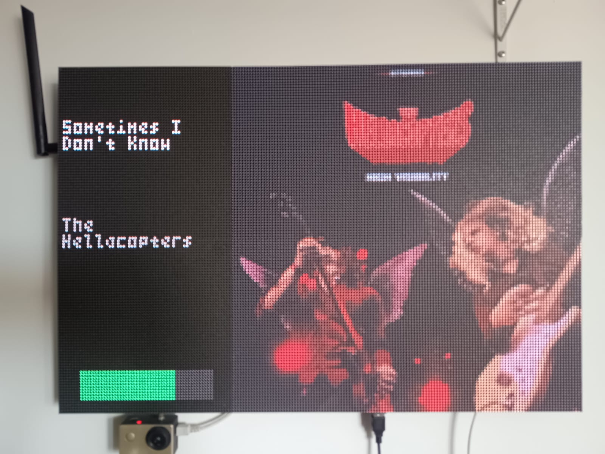
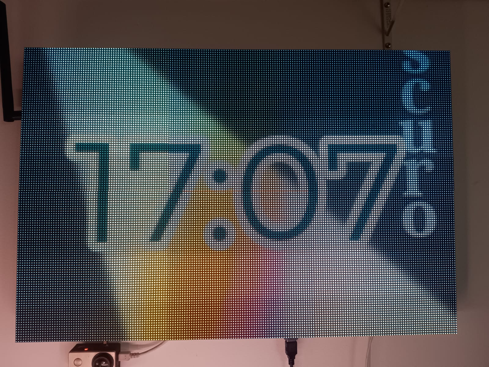
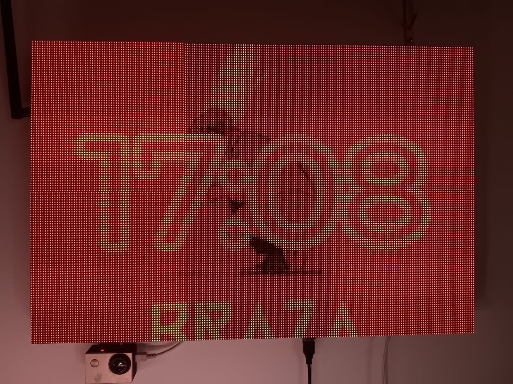
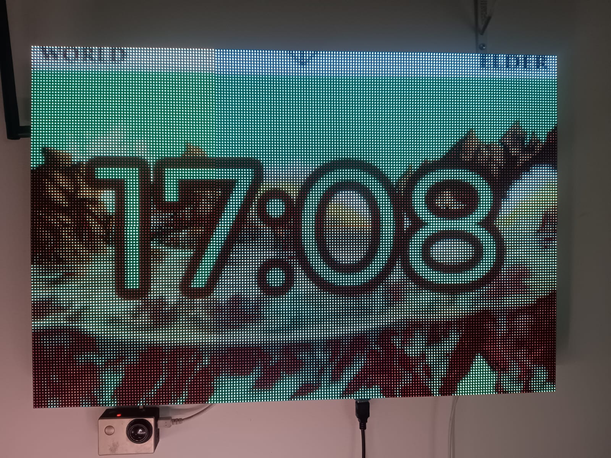

# rpi-spotify-matrix-display-big

A Spotify display for LED matrices forked from [kylejohnsonkj](https://github.com/kylejohnsonkj)'s [rpi-spotify-matrix-display](https://github.com/kylejohnsonkj/rpi-spotify-matrix-display), modified to run on a 192x128 matrix setup.

Note: All emulation code and emulator support have been removed from this fork — this
repository focuses on driving real 192x128 LED matrix hardware directly.

<p align="center">
  
</p>

### Album Art Display

<table>
  <tr>
    <td><a href="images/img_1.png" target="_blank"></a></td>
    <td><a href="images/img_2.png" target="_blank"></a></td>
    <td><a href="images/img_3.png" target="_blank"></a></td>
    <td><a href="images/img_4.png" target="_blank"></a></td>
  </tr>
  <tr>
    <td align="center"><a href="https://i.scdn.co/image/ab67616d00001e02d076021191250b5fec6b6c58" target="_blank"></a></td>
    <td align="center"><a href="https://i.scdn.co/image/ab67616d00001e021e0920912a7e005e8f4bae8f" target="_blank"></a></td>
    <td align="center"><a href="https://i.scdn.co/image/ab67616d00001e026c6fb228ad10a71122880a97" target="_blank"></a></td>
    <td align="center"><a href="https://i.scdn.co/image/ab67616d00001e02c2ae4095962f75cdf57750ca" target="_blank"></a></td>
  </tr>

</table>

## Hardware

- Repository: https://github.com/raulzanardo/my-led-matrix — contains panel
  specifications, and power recommendations for the 192x128 LED matrix used with this
  project.
- Brief: This fork targets a 192x128 RGB LED matrix driven by a Raspberry Pi (Pi 3 or Pi 4
  recommended). Use a dedicated 5V power supply sized for your panel (peak current can
  range from ~4A to 10A depending on brightness and panel size). See the linked repo for
  wiring diagrams, configuration files, and panel-specific notes.

## Spotify Pre-Setup

1. Go to https://developer.spotify.com/dashboard
2. Create an account and/or login
3. Select "Create an App" (name/description doesn't matter).
4. Under Redirect URIs add `http://127.0.0.1:8080/callback`, then save.
5. In the App settings copy the generated Client ID and Client Secret.
6. Paste the `client_id` and `client_secret` into `config.ini` (see next section).

## Quick Run (on a Pi)

1. Clone and enter the repo

   - `git clone --recurse-submodules https://github.com/kylejohnsonkj/rpi-spotify-matrix-display`
   - `cd rpi-spotify-matrix-display/`

2. Create `config.ini` from the example and edit it (set your Spotify credentials):

```bash
cp config.example.ini config.ini
# then edit config.ini and add your client_id / client_secret
```

3. Create and activate a Python virtual environment

```bash
python3 -m venv .venv
source .venv/bin/activate
```

4. Install dependencies

```bash
python3 -m pip install -r requirements.txt
```

5. Run the controller from the `impl/` directory

```bash
cd impl/
python3 controller_v3.py
```

Optional: run with the fullscreen flag:

```bash
python3 controller_v3.py --fullscreen
```

## Arguments

| Argument              | Default | Description                                       |
| :-------------------- | :------ | :------------------------------------------------ |
| `-f` , `--fullscreen` | false   | Always display album art in full screen (192x128) |
| `-h` , `--help`       | false   | Display help messages for arguments               |

## Configuration

Configuration is handled in `config.ini`. Copy `config.example.ini` to `config.ini` and update the Spotify section with your `client_id` and `client_secret`.

For Matrix configuration see https://github.com/hzeller/rpi-rgb-led-matrix#changing-parameters-via-command-line-flags. More extensive customization can be done in `impl/controller_v3.py`.

Note: The `shutdown_delay` value (in seconds) controls automatic screen shutdown when music is inactive — set `shutdown_delay = 0` to disable automatic shutdown and keep the display on.

For Spotify configuration, set the `client_id` and `client_secret` to your own. You may leave `redirect_uri` as-is. A `device_whitelist` option is available and is disabled by default.

## Acknowledgements

Thanks to allenslab and kylejohnsonkj for providing the original codebase for this project, [rpi-spotify-matrix-display](https://github.com/kylejohnsonkj/rpi-spotify-matrix-display) and [matrix-dashboard](https://github.com/allenslab/matrix-dashboard). You can find the original reddit post [here](https://www.reddit.com/r/3Dprinting/comments/ujyy4g/i_designed_and_3d_printed_a_led_matrix_dashboard/). This project adapts the Spotify app for 192x128 matrices and includes additional improvements.

Thanks to ty-porter for [his fork](https://github.com/ty-porter/matrix-dashboard) of matrix-dashboard from which development branched.

And finally, thanks to hzeller for his work on [rpi-rgb-led-matrix](https://github.com/hzeller/rpi-rgb-led-matrix).
